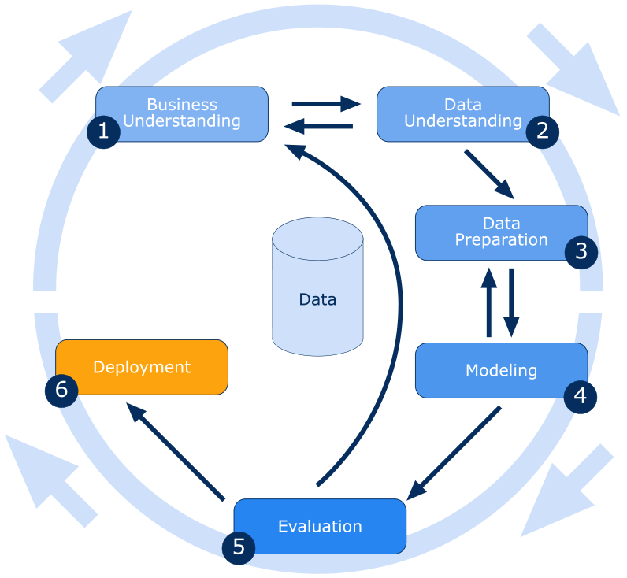

# Epitopos

Este projeto abrange uma demanda da área de bioinformática da UFSC. Por meio dessa demanda, foram aplicadas técnicas de mineração de dados para atingir o objetivo estabelecido.  
A metodologia de mineração de dados utilizada foi a **Metodologia CRISP-DM** (CRoss-Industry Standard Process for Data Mining).

## Fases do CRISP-DM

1. **Entendimento do Negócio (ou do problema)**: Identificação dos objetivos do usuário sob o ponto de vista de Descoberta de Conhecimento em Bases de Dados (DCBD) e elaboração de um plano inicial.
2. **Entendimento dos Dados**: A partir da coleta inicial, explorar os dados, verificando suas propriedades e qualidade.  
3. **Preparação de Dados**: Produção de um conjunto de dados adequado aos algoritmos de mineração.  
4. **Modelagem**: Corresponde à fase de Mineração de Dados.  
5. **Avaliação**: Interpretação e avaliação dos resultados em relação aos objetivos do usuário.  
6. **Disponibilização**: Planejamento da disponibilização, monitoramento e manutenção, produção de relatório final e revisão do projeto.

